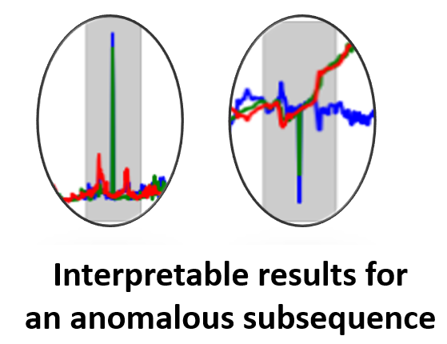
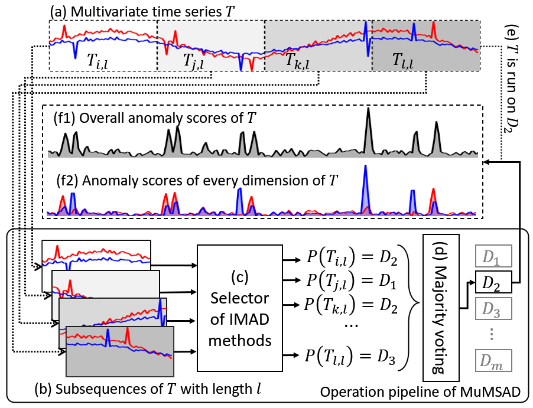
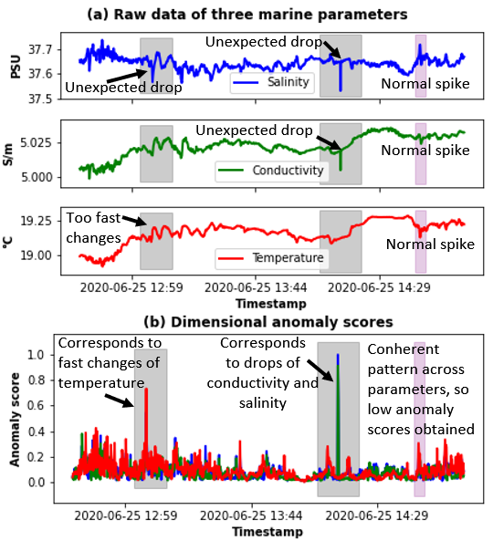

<p align="center">

</p>

<h1 align="center">
<h2 align="center">Interpretable Multivariate Anomaly Detector Selection </br>for Automatic Marine Data Quality Control</h2>

MuMSAD framework can be utilized for automatically selecting of ten interpretable multivariate anomaly detectors, with the proposed pipeline being illustrated below.

<div align="center">
  
</div>


The framework can be used in a wide range of applications, especially in root cause analysis. In our work, we have demonstrated the usefulness and practicability of MuMSAD in two real-world applications, requested by many of industrial and research collaborators.
- Automatic multi-parameter marine data quality control. The figure below demonstrates the overview idea of the application.
- Automatic identification of malfunctioning sensors in Remotely Operated Vehicles, which is requested by one of our industrial collaborators.

<div align="center">
  
</div>

MuMSAD is an extension of [MSAD](https://github.com/boniolp/MSAD), which is orignally designed for automatic selection of univariate anomaly detectors. MuMSAD is fully compatible to features supported in the original framework.

## Installation

To install and use MuMSAD from source, you will need the following tools:

- `git`
- `conda` (anaconda or miniconda)
- `docker`

#### Steps for installation

**Step 1:** Clone this repository using `git` and change into its root directory.

```bash
git clone https://github.com/ntnguyen-so/MuMSAD_framework.git
cd MuMSAD_framework/
```

**Step 2:** Create and activate a `conda` environment named `MuMMSAD`.

```bash
conda env create --file environment.yml
conda activate MuMSAD
```

> Note: If you plan to use GPU acceleration, please ensure that you have CUDA installed. You can refer to the [CUDA installation instructions](https://developer.nvidia.com/cuda-downloads) for guidance.

If you do not wish to create the `conda` environment, you can install only the dependencies listed in `requirements.txt` using the following command:

```
pip install -r requirements.txt
```
**4.** Build docker images of interpretable anomaly detectors (source files are under `interpretable_anomaly_detectors`). 
```bash
cd interpretable_anomaly_detectors
bash setup.sh
cd ..
```
The credit for base images goes to [TimeEval-algorithms](https://github.com/TimeEval/TimeEval-algorithms).

**5.** Installation complete!

## Data Preparation

Our models have been implemented to work with fixed-size inputs. Thus, before running any models, we first divide every time series in the used dataset into windows. Note that you can add your own time series here and divide them into windows, but make sure to follow the same format.

To produce a windowed dataset, run the following command:

```bash
python3 create_windows_dataset.py --save_dir=data/ --path=data/dataset/data/ --metric_path=data/dataset/metrics/ --window_size=512 --metric=AUC-PR --data_normalization=False
```

- save_dir: Path to save the dataset.
- path: Path of the dataset to divide into windows.
- metric_path: Path to the metrics of the dataset provided (to produce the labels).
- window_size: Window size (if the window size is larger than the time series' length, that time series is skipped).
- metric: Metric to use for producing the labels. The following metrics are supported: AUC-PR, VUS-PR, AUC-ROC, VUS-ROC, INTERPRETABILITY (based on HitRate@K), and AD_ACC (a customized metric shown Equation 4 in the paper). 
- data_normalization: Whether you want to normalize the data or not (True or False). In the work, we tested deep learning model selectors with normalized data. For feature-based selectors, we tested with unnormalized and normalized data.
Note: you can check out the script stored under `reproducibility_guide/data_preparation.sh` for examples of how to prepare data for MuMSAD.

### Extracting features
The feature-based methods require a set of features to be computed first, turning the time series into tabular data. To achieve this, we use the TSFresh and catch22 module, which computes a predefined set of features.

To compute the set of features for a segmented dataset, run the following command:

```bash
python3 generate_features.py --feature=catch22 --path=data/dataset_512/ 
```

- feature: feature extractors to be used (catch22, TSFresh, TS_minimal - only 9 feautres are extracted without emphasis on multivariate time series)
- path: Path to the dataset for computing the features (the dataset should be segmented first into windows; see the command above). The resulting dataset is saved in the same directory (**MANDATORY**).

Note: you can check out the script stored under `reproducibility_guide/genererate_features.sh` for examples of how to prepare features for feature-based model selectors of MuMSAD.

## Supported Model Selectors

There are 4 different types of model selectors you can use in the framework:
- Deep learning
- Feature-based
- Oracle (theoretical)
- Average Ensembling

Below we outline how to use them.

### Deep Learning 

To train a model, run the following command:

```bash
python3 train_deep_model.py --path=data/dataset_512/ --split=0.7 --file=experiments/supervised_splits/split_dataset_512.csv --model=resnet --params=models/configuration/resnet_default.json --batch=256 --epochs=10 --eval-true
```

- path: Path to the dataset to use.
- split: Split percentage for training and validation sets.
- seed: Seed for train/val split (optional).
- file: Path to a file that contains a specific split (to reproduce our results).
- model: Model to use (type of architecture).
- params: A JSON file with the model's parameters.
- batch: Batch size.
- epochs: Number of training epochs.
- eval-true: Whether to evaluate the model on test data after training.

> This script will save the following:
>
> - training specific information into _/MuMSAD_framework/results/done_training/resnet_default_512_11092023_162841.csv_ file.
> - TensorBoard data will be saved into _/MuMSAD_framework/results/runs/resnet_default_512_11092023_162726/_.
> - The trained weights will be saved in _/MuMSAD_framework/results/weights/resnet_default_512/_.
> - In case the 'eval-true' is selected, the results of the trained model on the test set will be saved in _/MuMSAD_framework/results/raw_predictions/resnet_512_preds.csv_.

To evaluate a model on a folder of CSV files, run the following command:

```bash
python3 eval_deep_model.py --data=data/dataset_512/MGAB/ --model=convnet --model_path=results/weights/supervised/convnet_default_512/model_30011024_173428 --params=models/configuration/convnet_default.json --path_save=results/raw_predictions/
```

- data: Path to the time series data to predict.
- model: Model to use.
- model_path: Path to the trained model.
- params: A JSON file with the model's parameters.
- path_save: Path to save the results.

> The results of the above inference example are saved in _/MuMSAD_framework/results/raw_predictions/convnet_512_preds.csv_.

To reproduce our specific results, run the following command:

```bash
python3 eval_deep_model.py --data=data/dataset_512/ --model=convnet --model_path=results/weights/supervised/convnet_default_512/model_30011024_173428 --params=models/configuration/convnet_default.json --path_save=results/raw_predictions/ --file=experiments/supervised_splits/split_dataset_512.csv
```

- file: Path to a file that contains a specific split (to reproduce our results).

### Feature-Based

To use feature-based model selectors, it is a prerequisite that feature extraction has been executed (see Section **Extracting features**). You can use the following classifiers:

- **knn**
- **svc_linear**
- **decision_tree**
- **random_forest**
- **mlp**
- **ada_boost**
- **bayes**
- **qda**

To train any of these classifiers, run the following command:

```bash
python3 train_feature_based.py --path=data/dataset_512/TSFRESH_dataset_512.csv --classifier=knn --split_per=0.7 --file=experiments/unsupervised_splits/unsupervised_testsize_1_split_0.csv --eval-true --path_save=results/weights/
```

- path: Path to the dataset to use.
- classifier: Classifier to run.
- split_per: Split percentage for training and validation sets.
- seed: Seed for splitting training and validation sets (use a small number for reproducibility).
- file: Path to a file that contains a specific split (if needed).
- eval-true: Whether to evaluate the model on test data after training.
- path_save: Path to save the trained classifier.

To evaluate a classifier, run the following command:

```bash
python3 eval_feature_based.py --data=data/dataset_512/TSFRESH_dataset_512.csv --model=knn --model_path=results/weights/knn_512/ --path_save=results/raw_predictions/
```

- data: Path to the time series data to predict.
- classifier: Classifier to run from the list above.
- classifier_path: Path to the trained classifier model.
- path_save: Path to save the results.

> Note: To reproduce our results run the training script with the 'eval-true' option and the 'file' argument set to the specific splits we used (found in the _/MuMSAD_framework/experiments/\*\_splits_ directories).

###  Oracle

The Oracle is a hypothetical model that simulates the accuracy of a model on a given benchmark and evaluates its anomaly detection ability. You can simulate Oracle with different accuracy values, ranging from 1 (always selecting the best detector for a time series) to zero (always selecting a wrong detector). Additionally, you can simulate Oracle with different modes of randomness, namely:

1. **true**: When wrong, randomly select another detector.
2. **lucky**: When wrong, always select the second best detector (upper bound).
3. **unlucky**: When wrong, always select the worst detector (lower bound).
4. **best-k**: When wrong, always select the k-th best detector (e.g., best-2 is lucky).

To compute Oracle, run the following command:

```bash
python3 run_oracle.py --path=data/dataset/metrics/ --acc=1 --randomness=true
```

- path: Path to metrics (the results will be saved here).
- acc: The accuracy that you want to simulate (a float between 0 and 1).
- randomness: The randomness mode that you want to simulate (see possible modes above).

> The results are saved in _/MuMSAD_framework/data/dataset/metrics/TRUE_ORACLE-100/_ (the name of the last folder and dataset name should change depending on the parameters).

### Averaging Ensemble

The Averaging Ensemble, or Avg Ens (in orange in the results figure at the end), is used to ensemble the anomaly scores produced by all the detectors, by computing their average. Depending on the metric you specified in `utils/config.py`, the accuracy/interpretablity is calculated accordingly.

To compute Avg Ens, run the following command:

```bash
python3 run_avg_ens.py --n_jobs=16
```

- n_jobs: The number of threads to use for parallel computation (specify an appropriate value).


